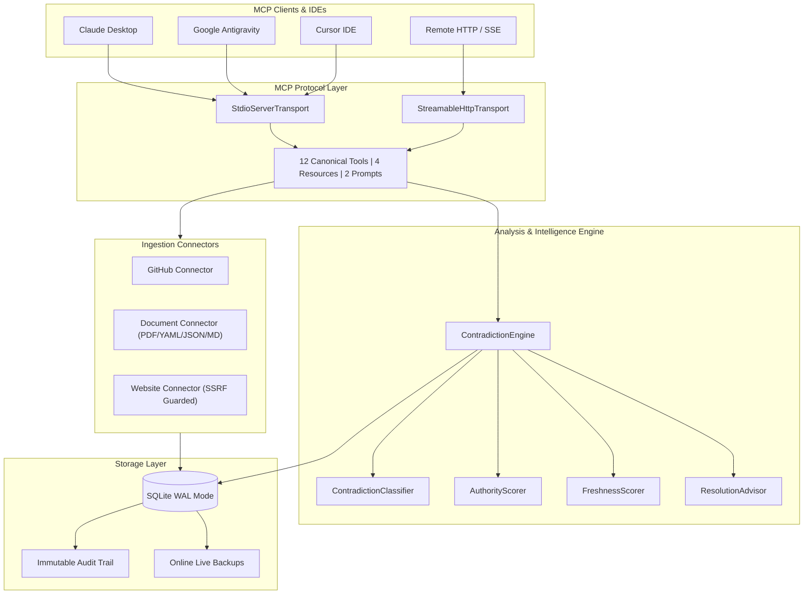

<div align="center">

# Contradiction MCP

**Autonomous Cross-Source Inconsistency & Contradiction Intelligence Engine for AI Agents**

[](https://github.com/Daksh-create349/Contradiction-MCP/actions/workflows/ci.yml)
[](../LICENSE)
[](https://nodejs.org/)
[](https://www.typescriptlang.org/)
[](https://modelcontextprotocol.io/)
[](tests)
[](package.json)
[](https://prettier.io/)

<p align="center">
  <a href="#the-problem-it-solves">Problem</a> •
  <a href="#core-capabilities">Capabilities</a> •
  <a href="#limitations--known-edge-cases">Limitations</a> •
  <a href="#system-architecture">Architecture</a> •
  <a href="#one-command-quickstart-all-ides">Quickstart</a> •
  <a href="#mcp-interface-12-canonical-tools-4-resources-2-prompts">Tools Reference</a> •
  <a href="#step-by-step-hands-on-tutorial">Tutorials</a> •
  <a href="#documentation-index">Docs</a> •
  <a href="#license">License</a>
</p>

</div>

---

> [!NOTE]
>
> ### Project Status: Active Development (v0.3.0)
>
> **Contradiction MCP is currently under active development.** Core multi-format document ingestion (Markdown, RFC822 `.eml`, OpenXML `.docx`, and JSON) and cross-document contradiction discovery are operational and verified. Heuristic classifiers, deep JSON scoping, and public APIs are actively evolving prior to v1.0.0.

---

## The Problem It Solves

Modern engineering ecosystems rely on fragmented, uncoordinated sources of truth:

- **Code Repositories**: `package.json`, `Dockerfile`, CI/CD workflows (`.github/workflows/*.yml`)
- **Deployment Manifests**: Kubernetes YAML, Helm values, cloud environment configurations
- **Technical Documentation**: Architecture guides, runbooks, developer setup portals, READMEs
- **Public Endpoints**: OpenAPI/Swagger schemas, status feeds, live web documentation

When these systems diverge—for example, a Kubernetes manifest deploying Node.js 22 while technical documentation instructs developers to run Node.js 18, or conflicting database engine versions across staging and production—silent regressions, deploy failures, and hallucinations in LLM reasoning occur.

**Contradiction MCP** bridges these silos through automated multi-source ingestion, context-aware contradiction reasoning, source authority and freshness scoring, human-in-the-loop review/resolution workflows, and immutable audit trails.

---

## Core Capabilities

- **Zero Mocks**: Real embedded SQLite with Write-Ahead Logging (WAL), real filesystem I/O with directory containment guards, and real HTTP fetchers with pre-flight DNS validation.
- **Context-Aware Contradiction Engine**: Eliminates false positives by understanding semantic contexts:
  - **Environments**: `production` vs `staging` vs `development`
  - **Scopes**: `file` vs `deployment` vs `cluster`
  - **Roles**: `source_of_truth` vs `deployment` vs `documentation`
- **Deterministic SemVer Mathematics**: Employs rigorous version range satisfaction algebra rather than naive string comparisons.
- **Multi-Source Ingestion Pipeline**:
  - **GitHub Connector**: Analyzes runtime engines, Dockerfiles, GitHub Actions workflows, and READMEs.
  - **Document Connector**: Extracts structured claims from JSON, YAML, Markdown, CSV, TXT, RFC822 (`.eml`), and OpenXML (`.docx`) documents with exact page- and line-numbered evidence citations.
  - **Public Website Connector**: Web crawler hardened with multi-layer SSRF protection against loopback, private IPv4/IPv6 CIDRs, and cloud metadata endpoints (`169.254.169.254`).
- **Scoring & Advisory Intelligence**:
  - `AuthorityScorer`: Ranks conflicting claims based on source hierarchy and origin credibility.
  - `FreshnessScorer`: Applies exponential half-life time decay models.
  * `EvidenceEvaluator`: Quantifies citation directness and snippet quality.
  - `ResolutionAdvisor`: Generates actionable resolution recommendations without mutating state without operator consent.
- **Review & Resolution Workflows**: Full lifecycle transitions (`OPEN` → `REVIEWED` → `RESOLVED` / `DISMISSED` → `REOPENED`) backed by append-only audit histories.
- **Dual Transport Architecture**: Operates over standard **Stdio** (for Claude Desktop, Google Antigravity, Cursor) or **Streamable HTTP/SSE** with Bearer API key authentication and sliding rate limiting.

---

## Limitations & Known Edge Cases

While Contradiction MCP is battle-tested on cross-document and cross-source consistency audits, users should be aware of current development limitations:

1. **Intra-Manifest Hierarchical Collisions (Deeply Nested JSON/YAML)**:
   - **Behavior**: Key-value extraction flattens object hierarchies into leaf tokens. In complex single manifests (such as Kubernetes deployments), parameters sharing identical leaf keys across distinct blocks (e.g., `readinessProbe.initialDelaySeconds` vs `livenessProbe.initialDelaySeconds`, or container `resources.requests.cpu` vs `resources.limits.cpu`) can trigger intra-file candidate comparisons and false-positive warnings.
   - **Mitigation**: Focus analysis on cross-document source verification or filter by external source boundaries. Hierarchical path-aware namespace isolation is currently under active development.

2. **Heading & Brand Entity Extraction**:
   - **Behavior**: Document headings containing version-like keywords (e.g., `"2. Node.js V8 Engine Upgrade"`) may occasionally extract the engine brand or section numeral as a software version string, triggering local version mismatch warnings against runtime version specifications.
   - **Mitigation**: Structure specifications using standard tables, key-value mappings, or explicit parameter declarations.

3. **Static Specifications vs Live Network State**:
   - **Behavior**: The engine analyzes declared assertions across files, repositories, and documentation. It does not probe live runtime sockets, ephemeral cloud infrastructure, or running processes unless synced as structured state documents.

4. **Candidate Pair Scalability on Giant Monoliths**:
   - **Behavior**: Files producing >1,000 claims increase pairwise combinations quadratically ($O(N^2)$ worst-case prior to similarity filtering).
   - **Mitigation**: Bounded file size guards (`MAX_FILE_SIZE_BYTES`, default 10MB) prevent memory exhaust. Partition giant monoliths into modular architecture specs.

5. **Language & Syntax Scope**:
   - **Behavior**: Extraction heuristics, unit normalizers (e.g., `GB`, `MB`, `ms`), and predicate patterns are currently tuned for English documentation and standard DevOps/software configuration keys. Multi-lingual natural language extraction without standard keying is planned for future releases.

---

## System Architecture

### Visual Dataflow



---

## One-Command Quickstart (All IDEs)

Automatically configure Contradiction MCP into your favorite editor with a single command:

### Universal CLI Setup

```bash
# Google Antigravity (configured in ~/.gemini/config/mcp_config.json and workspace)
npx -y contradiction-mcp install antigravity

# Cursor IDE (configured in ~/.cursor/mcp.json and workspace)
npx -y contradiction-mcp install cursor

# Claude Desktop App (configured in claude_desktop_config.json)
npx -y contradiction-mcp install claude

# Claude Code CLI (configured in ~/.claude.json & via claude mcp add)
npx -y contradiction-mcp install claude-code

# Windsurf IDE (configured in ~/.codeium/windsurf/mcp_config.json)
npx -y contradiction-mcp install windsurf

# Configure ALL detected IDEs simultaneously
npx -y contradiction-mcp install all
```

### Local Setup from Cloned Source

```bash
git clone https://github.com/Daksh-create349/Contradiction-MCP.git
cd "Contradiction MCP/contradiction-mcp"
npm install
npm run build

# Automatically configure in your current environment:
npm run install-mcp

# Or target a specific IDE:
node bin/cli.js install [antigravity|cursor|claude|claude-code|windsurf|all]
```

---

## Manual IDE Client Configuration

If you prefer manual configuration, add the following configuration block to your client settings:

### 1. Claude Desktop (`claude_desktop_config.json`)

- **macOS**: `~/Library/Application Support/Claude/claude_desktop_config.json`
- **Windows**: `%APPDATA%\Claude\claude_desktop_config.json`
- **Linux**: `~/.config/Claude/claude_desktop_config.json`

```json
{
  "mcpServers": {
    "contradiction": {
      "command": "node",
      "args": ["/ABSOLUTE/PATH/TO/contradiction-mcp/dist/index.js"],
      "env": {
        "NODE_ENV": "production",
        "DATABASE_PATH": "/ABSOLUTE/PATH/TO/contradiction-mcp/data/contradiction.db",
        "MCP_TRANSPORT": "stdio",
        "LOG_LEVEL": "error"
      }
    }
  }
}
```

### 2. Google Antigravity (`mcp_config.json`)

- **Global**: `~/.gemini/config/mcp_config.json`
- **Workspace**: `<workspace-root>/.agents/mcp_config.json`

```json
{
  "mcpServers": {
    "contradiction": {
      "command": "node",
      "args": ["/ABSOLUTE/PATH/TO/contradiction-mcp/dist/index.js"],
      "env": {
        "NODE_ENV": "production",
        "DATABASE_PATH": "/ABSOLUTE/PATH/TO/contradiction-mcp/data/contradiction.db",
        "MCP_TRANSPORT": "stdio",
        "LOG_LEVEL": "error"
      }
    }
  }
}
```

### 3. Cursor IDE (`.cursor/mcp.json`)

```json
{
  "mcpServers": {
    "contradiction": {
      "command": "node",
      "args": ["/ABSOLUTE/PATH/TO/contradiction-mcp/dist/index.js"]
    }
  }
}
```

### 4. Streamable HTTP Remote Client

Connect distributed agents or team members to a centralized server daemon:

```json
{
  "mcpServers": {
    "contradiction": {
      "url": "http://localhost:3000/mcp",
      "headers": {
        "Authorization": "Bearer YOUR_SECRET_API_KEY"
      }
    }
  }
}
```

---

## MCP Interface: 12 Canonical Tools, 4 Resources, 2 Prompts

Contradiction MCP exposes **12 canonical tools** engineered to the highest specification standards (Glama Tool Definition Quality Score **5.0 / 5.0 Grade A**). Every tool strictly follows `verb_noun` nomenclature, provides rich typed schemas, and isolates distinct operational domains.

### Active Canonical MCP Tools (12)

| Tool Name               | Operational Domain | Description                                                                                 | Key Arguments                                                        |
| :---------------------- | :----------------- | :------------------------------------------------------------------------------------------ | :------------------------------------------------------------------- |
| `check_health`          | Diagnostics        | Verifies server runtime health, database connectivity, and active connector health          | `{}`                                                                 |
| `list_sources`          | Discovery          | Lists registered knowledge sources and connector types with pagination                      | `type`, `limit`, `offset`                                            |
| `test_connection`       | Connectivity       | Validates credentials, permissions, and network reachability without persisting data        | `type`, `target`, `credentials`                                      |
| `sync_source`           | Ingestion          | Unified ingestion engine for files, Markdown, Word (.docx), JSON, URLs, or Git repositories | `sourceId` OR (`filePath` / `url` / `owner`+`repo`), `subject`       |
| `scan_contradictions`   | Intelligence       | Scans the knowledge base, a source, or a claim for logical/semantic contradictions          | `sourceId`, `claimId`, `limit`, `minConfidence`, `includeDismissed`  |
| `analyze_claim_pair`    | Intelligence       | Performs pairwise contradiction and contextual relationship analysis between two claims     | `claimIdA`, `claimIdB`                                               |
| `list_claims`           | Knowledge Base     | Lists extracted factual claims with multi-field filtering and pagination                    | `sourceId`, `subject`, `predicate`, `environment`, `limit`, `offset` |
| `get_claim`             | Knowledge Base     | Retrieves factual claim details, contextual metadata, and audit supersession history        | `claimId`                                                            |
| `list_contradictions`   | Lifecycle          | Queries detected contradictions filtered by lifecycle status, severity, and confidence      | `status`, `severity`, `minConfidence`, `limit`, `offset`             |
| `get_contradiction`     | Lifecycle          | Retrieves full contradiction state, conflicting claims, and contextual explanation          | `contradictionId`                                                    |
| `advise_resolution`     | Advisory           | Evaluates source authority, freshness, and evidence quality to recommend canonical truth    | `contradictionId`                                                    |
| `resolve_contradiction` | Resolution         | Executes lifecycle transitions (`REVIEW`, `RESOLVE`, `DISMISS`, `REOPEN`) with audit trail  | `contradictionId`, `action`, `actor`, `reason`, `canonicalClaimId`   |

> [!TIP]
> **Full Backwards Compatibility**: Legacy tool names (`health_check`, `sync_document`, `sync_website`, `sync_github_repository`, `scan_for_contradictions`, `scan_claim_for_contradictions`, `scan_source_for_contradictions`, `explain_claim_relationship`, `review_contradiction`, `dismiss_contradiction`, `reopen_contradiction`, `get_contradiction_history`, `get_claim_history`, `list_connectors`, `test_github_connection`, `sync_sources`) continue to function without error via automatic request routing and parameter translation.

### Active MCP Resources (4)

- `health://metrics` — Static snapshot of uptime, tool invocations, and contradiction tallies.
- `contradiction://{id}` — Dynamic resource returning live contradiction state for a specific ID.
- `claim://{id}` — Dynamic resource returning factual claim details, context, and provenance.
- `source://{id}` — Dynamic resource returning source metadata, type, and trust score.

### Active MCP Prompts (2)

- `investigate_contradiction` — Interactive prompt guiding contradiction investigation, context analysis, and resolution.
- `review_source_consistency` — Agent prompt guiding systematic cross-source consistency audits.

---

## Example Tool Payloads & Responses

<details>
<summary><b>1. Ingesting a Document (<code>sync_source</code> / legacy: <code>sync_document</code>)</b></summary>

**Request**:

```json
{
  "filePath": "/tmp/deployment_spec.json",
  "subject": "api-server",
  "scope": "deployment",
  "environment": "production",
  "sourceRole": "deployment"
}
```

**Response**:

```json
{
  "success": true,
  "sourceId": "76be8d2f-1e3b-48fd-922f-1b499251ac2b",
  "claimsCreated": 2,
  "claimsUpdated": 0
}
```

</details>

<details>
<summary><b>2. Scanning for Contradictions (<code>scan_contradictions</code> / legacy: <code>scan_for_contradictions</code>)</b></summary>

**Request**:

```json
{}
```

**Response**:

```json
{
  "status": "completed",
  "claimsScanned": 4,
  "candidatePairs": 2,
  "contradictionsFound": 1,
  "contradictions": [
    {
      "contradictionType": "VERSION_MISMATCH",
      "severity": "HIGH",
      "confidence": 1.0,
      "explanation": "Both claims describe the node_version for 'api-server'. However, architecture_guide.md reports '18.0.0' while deployment_spec.json reports '22.0.0'. Classified as VERSION_MISMATCH with HIGH severity.",
      "priorityScore": 0.93,
      "contradictionId": "2f1691be-9c1f-4e93-a86a-ef0c0ba54f9d"
    }
  ]
}
```

</details>

<details>
<summary><b>3. Resolution Advice (<code>advise_resolution</code>)</b></summary>

**Request**:

```json
{
  "contradictionId": "2f1691be-9c1f-4e93-a86a-ef0c0ba54f9d"
}
```

**Response**:

```json
{
  "recommendedClaimId": "a779fa4b-c680-482c-8f31-daf470aaaab7",
  "recommendedValue": "22.0.0",
  "confidenceScore": 0.88,
  "reasoning": "Claim B represents a higher-confidence candidate for current truth because it carries higher operational authority (0.85 vs 0.65) as deployment configuration and is equally fresh.",
  "authorityScoreA": 0.65,
  "authorityScoreB": 0.85
}
```

</details>

---

## Step-by-Step Hands-On Tutorial

### Tutorial: Detecting Real Document Contradictions in 30 Seconds

```bash
cd contradiction-mcp

# 1. Create two contradictory specifications for the same service:
cat << 'EOF' > /tmp/deployment_spec.json
{
  "node_version": "22.0.0",
  "database": "postgres-16"
}
EOF

cat << 'EOF' > /tmp/architecture_guide.md
# Architecture Guide
node_version: 18.0.0
database: postgres-14
EOF

# 2. Run test script to ingest and scan via Stdio MCP client:
npx tsx -e '
import { StdioClientTransport } from "@modelcontextprotocol/client/stdio";
import { Client } from "@modelcontextprotocol/client";

async function main() {
  const client = new Client({ name: "tester", version: "1.0.0" }, { capabilities: {} });
  await client.connect(new StdioClientTransport({ command: "node", args: ["dist/index.js"] }));

  // Ingest Deployment Spec (canonical: sync_source, role: deployment)
  await client.callTool({
    name: "sync_source",
    arguments: { filePath: "/tmp/deployment_spec.json", subject: "api-server", sourceRole: "deployment", environment: "production" }
  });

  // Ingest Architecture Guide (canonical: sync_source, role: documentation)
  await client.callTool({
    name: "sync_source",
    arguments: { filePath: "/tmp/architecture_guide.md", subject: "api-server", sourceRole: "documentation", environment: "production" }
  });

  // Automatically scan knowledge base (canonical: scan_contradictions)
  const scan = await client.callTool({ name: "scan_contradictions", arguments: {} });
  console.log("\nDISCOVERED CONTRADICTIONS:\n", JSON.stringify(JSON.parse(scan.content[0].text), null, 2));

  await client.close();
}
main();
'
```

---

## Complete Command Reference

| Command                  | Description                                                                  |
| :----------------------- | :--------------------------------------------------------------------------- |
| `npm run build`          | Compiles TypeScript and packages SQL migration scripts                       |
| `npm start`              | Launches compiled production server (`node dist/index.js`)                   |
| `npm run dev`            | Runs development server with on-the-fly TypeScript execution                 |
| `npm test`               | Runs complete Vitest test suite (**173 tests across 24 files**)              |
| `npm run test:coverage`  | Generates detailed V8 code coverage report                                   |
| `npm run verify`         | Runs all 62 end-to-end verification gates (protocol, security, heuristics)   |
| `npm run demo`           | Executes live 17-step end-to-end demonstration scenario                      |
| `npm run smoke`          | Launches compiled server and verifies real MCP Stdio connectivity            |
| `npm run live-test`      | Runs stdio smoke tests followed by Streamable HTTP integration suite         |
| `npm run typecheck`      | Validates TypeScript static typing (`tsc --noEmit`) with 0 errors            |
| `npm run lint`           | Lints codebase with ESLint 9 Flat Config (0 errors, 0 warnings)              |
| `npm run format:check`   | Verifies code formatting against Prettier                                    |
| `npm run format`         | Auto-formats all code using Prettier                                         |
| `npm run install-mcp`    | Automatically configures MCP settings across Antigravity, Cursor, and Claude |
| `npm run migrate`        | Executes pending SQLite database schema migrations                           |
| `npm run seed`           | Seeds database with realistic demonstration claims and sources               |
| `npm run backup`         | Creates zero-downtime online SQLite backup in `backups/`                     |
| `npm run restore <path>` | Restores database from a designated backup archive                           |
| `npm run health`         | Queries system health status and outputs operational JSON                    |
| `npm run security:check` | Runs `npm audit` to inspect dependency security vulnerabilities              |

---

## Environment Variables

| Variable               | Default                   | Description                                                  |
| :--------------------- | :------------------------ | :----------------------------------------------------------- |
| `NODE_ENV`             | `development`             | Runtime mode: `development`, `test`, or `production`         |
| `DATABASE_PATH`        | `./data/contradiction.db` | Path to SQLite database file or `:memory:`                   |
| `MCP_TRANSPORT`        | `stdio`                   | Transport mode: `stdio` or `http`                            |
| `HTTP_PORT`            | `3000`                    | Port for Streamable HTTP server when `MCP_TRANSPORT=http`    |
| `HTTP_HOST`            | `127.0.0.1`               | Binding address for HTTP daemon (DNS rebinding guarded)      |
| `API_KEY`              | _(optional)_              | Secret bearer token required for HTTP authentication         |
| `GITHUB_TOKEN`         | _(optional)_              | Personal Access Token to prevent GitHub API rate limits      |
| `LOG_LEVEL`            | `error`                   | Logging level: `debug`, `info`, `warn`, `error`              |
| `ALLOWED_ROOTS`        | `.`                       | Comma-separated directory paths permitted for file ingestion |
| `MAX_FILE_SIZE_BYTES`  | `10485760` (10MB)         | Maximum file size allowed for document ingestion             |
| `RATE_LIMIT_MAX`       | `100`                     | Maximum requests permitted per sliding time window           |
| `RATE_LIMIT_WINDOW_MS` | `60000` (1 min)           | Sliding rate limiter window in milliseconds                  |

---

## Docker & Container Deployment

### Run with Docker

```bash
# Build production container (multi-stage, non-root user):
docker build -t contradiction-mcp:latest .

# Run container with persistent data volume:
docker run -d \
  --name contradiction-mcp \
  -p 3000:3000 \
  -v contradiction-data:/app/data \
  -e MCP_TRANSPORT=http \
  -e HTTP_PORT=3000 \
  contradiction-mcp:latest
```

### Run with Docker Compose

```bash
docker compose up -d
docker compose ps
docker compose logs -f
```

---

## Release History

### v0.3.0 (2026-09-14)

- **12 Canonical Tools Architecture**: Streamlined tool interface into 12 orthogonal, strictly typed `verb_noun` tools (`check_health`, `list_sources`, `test_connection`, `sync_source`, `scan_contradictions`, `analyze_claim_pair`, `list_claims`, `get_claim`, `list_contradictions`, `get_contradiction`, `advise_resolution`, `resolve_contradiction`).
- **Zero-Breaking Backwards Compatibility Routing**: Added a transparent request router shim ensuring all legacy tool names continue to function seamlessly with argument translation.
- **Enhanced OpenXML (.docx) Ingestion**: Direct extraction of table structures (`<w:tr>`, `<w:tc>`) as key-value assertions with XML stripping to eliminate duplicate claims.
- **Multi-Format Cross-Document Consistency**: Verified cross-referencing and contradiction discovery across Markdown runbooks, JSON configs, and Word architecture documents.
- **Parametric Claim Queries**: Extended SQLite database layer with multi-field filtering (`predicate`, `environment`, `valueType`, `limit`, `offset`).

### v0.2.1 (2026-09-14)

- **22 Active MCP Tools**: Full interface alignment including `scan_source_for_contradictions` for targeted source discovery.
- **Section Heading Namespacing in Markdown**: Hierarchical markdown headings (`##` to `######`) namespace nested properties (e.g. `### API Gateway` $\rightarrow$ `api_gateway_port`), preventing intra-document collisions while matching nested JSON configurations.
- **Precision Predicate Similarity Guard**: Enhanced `claimMatcher` requiring $\ge 50\%$ token overlap on multi-token phrases, eliminating false matches between distinct properties sharing generic suffixes (`node_version` vs `cache_version`, `runtime_node_version` vs `runtime_python_version`).
- **Scoped JSON Extraction**: Streamlined `flattenJsonObject` to emit unique composite paths, avoiding leaf key duplication explosions.
- **Numeric Claim Validation**: Excluded valid single-digit numbers (`4`, `3`) from short-value extraction warnings.
- **Multi-Format Ingestion**: End-to-end verified across Markdown, JSON, OpenXML `.docx`, and Kubernetes manifests.

### v0.2.0 (2026-09-13)

- Initial public release with 21 core MCP tools, SQLite WAL persistence, GitHub, Document, and Website ingestion connectors.

---

## Documentation Index

- [Architecture Guide](docs/architecture.md) — Layered design, protocol topology, and component contracts.
- [Security Model](docs/security.md) — Multi-layer SSRF defenses, directory containment, and scope authorizations.
- [Connectors Reference](docs/connectors.md) — GitHub, Document (PDF/JSON/YAML/CSV/TXT), and Website connectors.
- [Database & Migrations](docs/database.md) — Schema definitions, audit tables, and WAL configuration.
- [Operations & Runbook](docs/operations.md) — Online backups, rate limiting, scheduling, and graceful shutdown.
- [Testing Strategy](docs/testing.md) — Zero-mock philosophy, test suite itemization, and benchmarks.
- [Practical Examples](docs/examples.md) — Detailed walkthroughs of real-world contradiction scenarios.

---

## License

This project is licensed under the **[MIT License](../LICENSE)**.

```text
MIT License
Copyright (c) 2026 Daksh Srivastava and Contradiction MCP Contributors
```

Free and open-source software — you are free to use, modify, distribute, sublicense, and deploy Contradiction MCP in personal and commercial environments.
